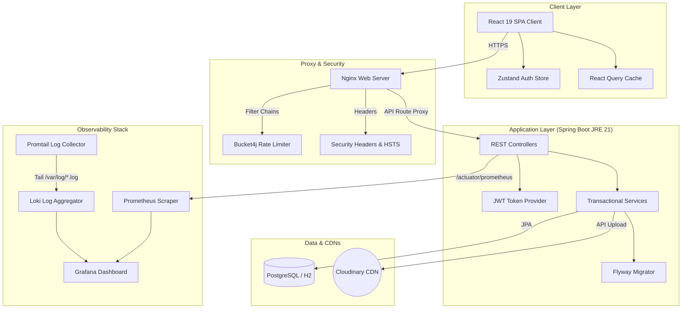

# 🐾 Animal Welfare & Wellness Community Platform

> A production-grade, containerized full-stack platform designed to connect stray animals with loving families, optimize rescue workflows, and facilitate volunteer moderation.

[](https://github.com/aayushsaw/Animal_Welfare_and_Wellness/actions/workflows/ci.yml)
[](https://openjdk.org/)
[](https://spring.io/)
[](https://react.dev/)
[](https://www.typescriptlang.org/)
[](https://tailwindcss.com/)
[](LICENSE)

---

## 📖 Project Overview

The Animal Welfare and Wellness Platform is a fully decoupled full-stack monorepo. It features a stateless Spring Boot Java REST API, a modular React SPA built with TypeScript, an integrated Grafana/Loki/Prometheus observability stack, automated backup/restore scripts, and robust automated end-to-end (E2E) testing.

### Key Objectives
* **Connect Strays with Adopters:** Create a clean, visually premium, and highly responsive companion search engine.
* **Streamline Rescue Posting:** Allow rescuers to post rescues with multiple image attachments.
* **Standardize Adoptions:** Introduce a structured multi-stage adoption flow (Pending request -> Admin/Volunteer review -> Approved/Adopted).
* **Verify System Reliability:** Provide 100% automated test coverage for critical user authentication and adoption workflows.

---

## 🛠️ System Architecture

The following diagram illustrates the Decoupled Service Architecture:



---

## 🚀 Getting Started (Quick Start)

The project is preconfigured to run immediately in development mode using a zero-config H2 database.

### 1. Launch the Spring Boot Backend
* **Requirements:** JDK 21+ (or JDK 25)

```bash
cd animal-welfare-java

# Windows (Development Run)
.mvn\wrapper\maven\apache-maven-3.9.6\bin\mvn.cmd spring-boot:run
```
The REST API starts up at **http://localhost:8080** and seeds the database automatically.

### 2. Launch the React Frontend
* **Requirements:** Node.js v20+

```bash
cd animal-welfare-frontend

# Install node packages
npm install

# Start Vite dev server
npm run dev
```
The Vite development server starts up at **http://localhost:5173**. Client-side API requests are automatically reverse-proxied to port `8080`.

---

## 🐳 Docker Compose Deployment (Production Config)

To spin up the entire production-ready stack in containers:
1. Ensure Docker Desktop is running.
2. Run the following command from the monorepo root directory:

```bash
docker compose up -d --build
```

**Exposed Services:**
* **Frontend SPA:** http://localhost (Port 80)
* **Backend REST API:** http://localhost:8080 (Port 8080)
* **PostgreSQL Database:** Port 5432

---

## 📊 Observability & Monitoring Stack

The platform includes a monitoring system utilizing Grafana, Loki, Promtail, and Prometheus.

To spin up the monitoring stack:
```bash
docker compose -f observability/docker-compose.yml up -d
```

**Exposed Dashboards:**
* **Grafana Panel:** http://localhost:3000 (Credentials: `admin` / `admin`)
* **Prometheus Endpoint:** http://localhost:8080/actuator/prometheus
* **Loki Log Broker:** http://localhost:3100

---

## 🧪 Running the Test Suites

We enforce automated test execution across both the frontend and backend layers:

### 1. Run Backend Unit & Integration Tests
Execute JUnit testing validations:
```bash
cd animal-welfare-java
./mvnw clean test
```

### 2. Run Frontend Unit Tests
Execute Vitest store and component structure validations:
```bash
cd animal-welfare-frontend
npm run test
```

### 3. Run Playwright End-to-End (E2E) Tests
Ensure the backend (`mvn spring-boot:run`) and frontend (`npm run dev`) servers are running, then execute Playwright E2E tests:
```bash
cd animal-welfare-frontend
npx playwright test
```

---

## 🌐 Production Deployment & Environment Variables

The platform is optimized for zero-overhead deployment on platforms like Render (for containerized backend services) and Vercel (for frontend static SPA hosting).

### Backend Production Environment Variables
| Variable | Description | Example / Recommended Value |
| :--- | :--- | :--- |
| `SPRING_DATASOURCE_URL` | PostgreSQL connection string | `jdbc:postgresql://<host>:<port>/<dbname>` |
| `SPRING_DATASOURCE_USERNAME` | Database username | `db_user` |
| `SPRING_DATASOURCE_PASSWORD` | Database password | `secure_password` |
| `JWT_SECRET` | Secret key used for signing HS256 tokens | *Custom 256-bit secure secret key* |
| `CLOUDINARY_URL` | Unified Cloudinary credentials string | `cloudinary://<api_key>:<api_secret>@<cloud_name>` |

### Frontend Production Environment Variables
| Variable | Description | Value |
| :--- | :--- | :--- |
| `VITE_API_URL` | Base URL of the deployed Render backend | `https://your-backend-app.onrender.com` |

---

## 🔑 Demo Access Credentials

The database is pre-seeded with the following accounts for platform verification:

| Username | Password | Roles |
| :--- | :--- | :--- |
| `admin` | `password123` | `ROLE_USER`, `ROLE_ADMIN` |
| `aayush` | `password123` | `ROLE_USER` |
| `manthan` | `password123` | `ROLE_USER` |

---

## 💾 Database Backup & Restore Procedures

Dedicated SQL backup scripts are available under `database/`. For backup operations, disaster recovery plans, and details, please refer to [docs/BACKUP_PROCEDURE.md](docs/BACKUP_PROCEDURE.md).

* **Run Backup (Windows):** `.\database\backup-db.bat`
* **Run Restore (Windows):** `.\database\restore-db.bat <backup_file.sql>`

---

## 📄 License

This project is licensed under the MIT License - see the [LICENSE](LICENSE) file for details.
